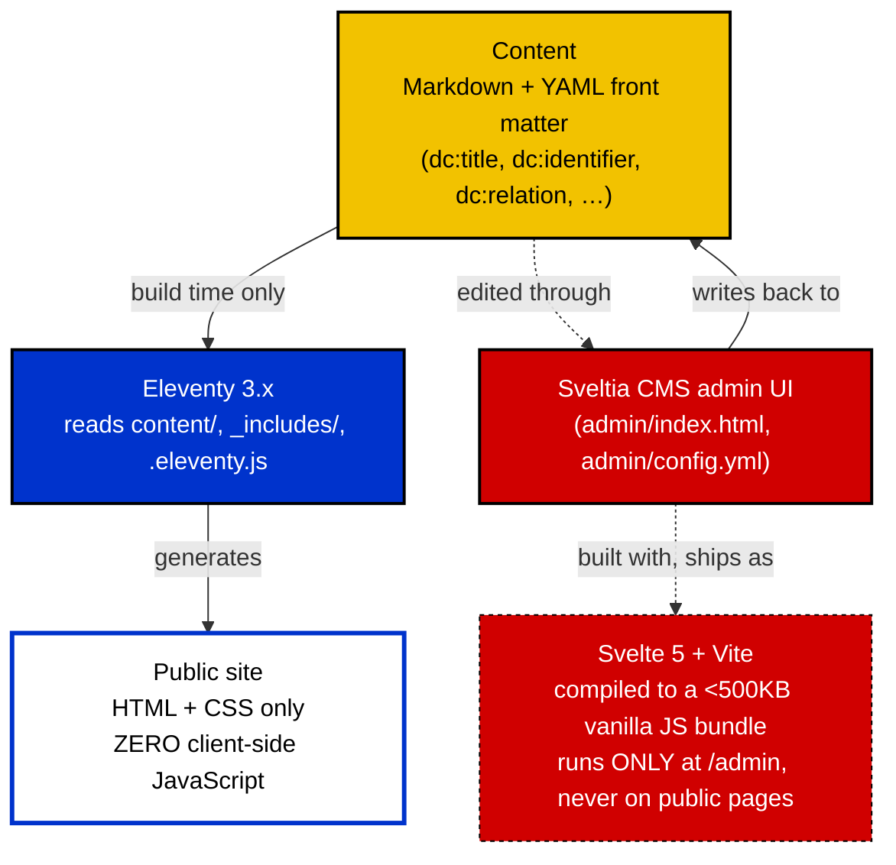

# The Stack: Eleventy, Sveltia CMS, and Where Svelte Actually Is

## The generic comparison, and where it needs correcting

The Eleventy-vs-Svelte table is accurate as a description of the two
tools in the abstract:

|                      | Eleventy                           | Svelte                              |
| -------------------- | ----------------------------------- | ------------------------------------ |
| What it is           | Static site generator               | UI/component framework               |
| Primary job           | Build pages from content/templates | Build interactive interfaces         |
| Runs                  | Mainly at build time                | Build time + browser                 |
| Output                | HTML/CSS/JS                         | JavaScript + HTML/CSS                |
| JavaScript required?  | Usually very little                 | Only where needed                    |
| Best for              | Content-heavy sites                 | Interactive applications/components  |

Where it stops describing *this* project: it frames the decision as
"how much Svelte to add to the public site," ranging from none, to
islands, to a full SvelteKit build. What's actually been built sits
outside that whole spectrum on one side, and uses Svelte on the other
side in a way the original draft didn't anticipate.

## What's actually running, concretely

Two separate facts, easy to blur together if you only skim the tooling
names:

**The public site ships zero JavaScript.** Not "minimal" — zero. The
mobile nav went through exactly this argument already: an earlier
version used a small hand-written script for a hamburger drawer, and it
was deleted outright once a native `
/
` disclosure
turned out to do the same job with no script at all. That's not "HTML
first, JavaScript when necessary" as an aspiration — it's the literal
current state of every page this project has built. There currently
isn't a single case on the public site where an interactive island has
earned its cost under that standard. The draft's example list of
island candidates — search, language selector, interactive navigation,
calculator, form, gallery, filter — is worth checking item by item
against what's already shipped: the language selector exists, built in
plain HTML with a server-rendered fallback state for missing
translations, no JS. The interactive navigation exists, and lost its
JS partway through this project specifically because the JS version
turned out to be the worse solution, not a stepping stone to a better
one. Of the original list, what's genuinely still unclaimed by a
zero-JS approach is closer to: a live search-as-you-type, a real
multi-field calculator, actual data visualization. That's a much
narrower set than "here are seven things Svelte islands are good for"
implied.

**Svelte is already in the stack — running the admin tool, not the
site.** Sveltia CMS is, confirmed directly rather than assumed, "built
completely from scratch with Svelte instead of forking React-based
Netlify/Decap CMS," compiling to a sub-500KB vanilla JS bundle with no
virtual DOM overhead — literally an order of magnitude smaller than the
React-based alternatives it replaced. That bundle runs at `/admin` only,
for the person editing content, never on a page a visitor loads. This
is the real-world instance of the pattern the original draft was
reaching for — "Svelte only where it earns its place" — except the
place it earned isn't an island in the site, it's the entire authoring
tool, chosen in part *because* it was built with Svelte rather than a
heavier alternative.

## What this means for "which would I choose"

Reframing the original three options against what's actually true here:

**Eleventy + zero JS** — not a hypothetical option under consideration,
this is the current, verified state of the public site.

**Sveltia CMS (Svelte-built) for authoring** — also not hypothetical,
already integrated (`admin/config.yml`). Chosen on its own merits
(git-based content, no proprietary datastore, small compiled footprint)
independent of whether the public site ever uses Svelte itself.

**A future Svelte island in the public site** — still a live option,
narrowed to genuine interaction cases (data visualization, a real
calculator, live search) rather than the broader original list, several
items of which turned out to have adequate zero-JS solutions once
actually built. Worth evaluating each candidate against the Universal
Cake Resilience and Sustainability commitments already written into the
site's own Commitments page before adding one — the same bar that ruled
out the JS nav drawer applies to any future island, not just to
navigation specifically.

## Note on the diagram source

The Mermaid diagram above follows the same convention as the FRBR/DC
diagrams built earlier in this project: solid arrows for build-time
data flow, dashed for "this exists but isn't the main event," and
labels naming what's actually true rather than what's aspirational.
